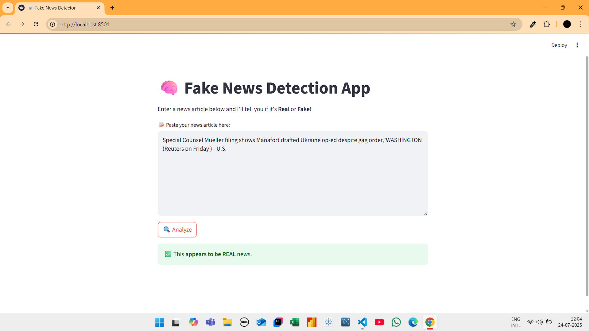

# 📰 Fake News Detection

A machine learning web app that classifies news as real or fake using NLP and logistic regression. Built with Python, Scikit-learn, and Streamlit.

## 🔧 Technologies Used
- Python
- Scikit-learn
- NLP (TF-IDF, CountVectorizer)
- Streamlit

## 🚀 Features
- Text preprocessing: stopword removal, lemmatization
- TF-IDF vectorization
- Real-time prediction via Streamlit web app

## 📦 Installation
```bash
pip install -r requirements.txt
streamlit run app.py


## 🖼️ Demo Screenshot



